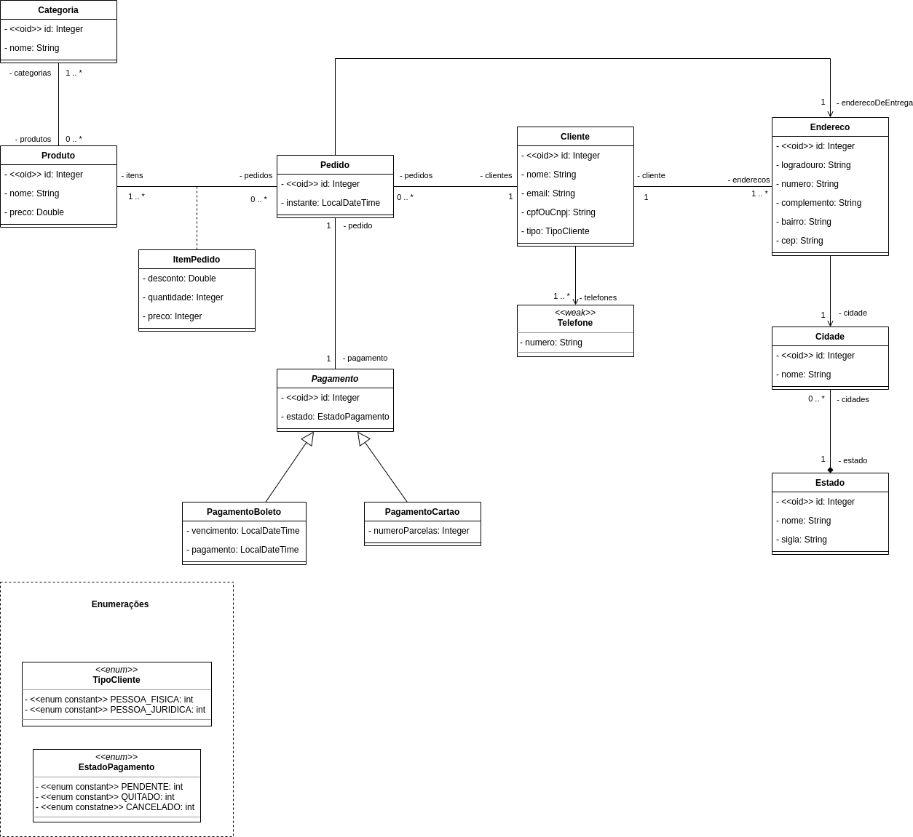
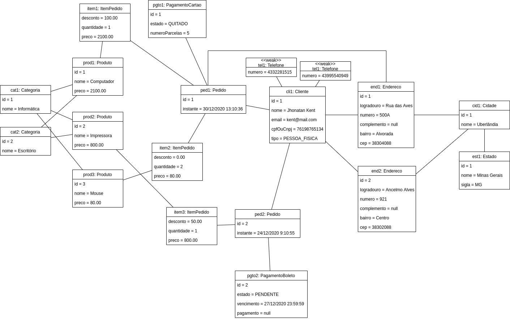

# Sistema de pedidos

Deseja-se fazer um sistema de pedidos. Um ou mais produtos podem ser vendidos em cada pedido, sendo que a cada produto pode ser dado um desconto diferente, e também cada produto pode ser vendido em uma ou mais unidades. Cada produto possui nome e preço, e pode pertencer a várias categorias. Cada pedido é feito por um cliente, que deve ter em seu cadastro nome, telefones, email, cpf ou cnpj, e um ou mais endereços, sendo que o cliente deve especificar um endereço para entrega na hora de comprar. Para um pedido, deve ser registrado o instante em que é realizado e o endereço de entrega. Um pedido deve ser pago ou por boleto, ou por cartão de crédito. No caso de boleto, deve-se armazenar a data de vencimento e a data de pagamento. No caso de cartão de crédito, deve-se armazenar o número de parcelas. Todo pagamento possui um estado (pendente, quitado ou cancelado).

A partir do texto acima identificou-se todas as classes e seus atributos. Assim, o diagrama de classes abaixo foi gerado:

Além disso, foi adicionado um diagrama de objetos que são instanciados ao iniciar da aplicação:
